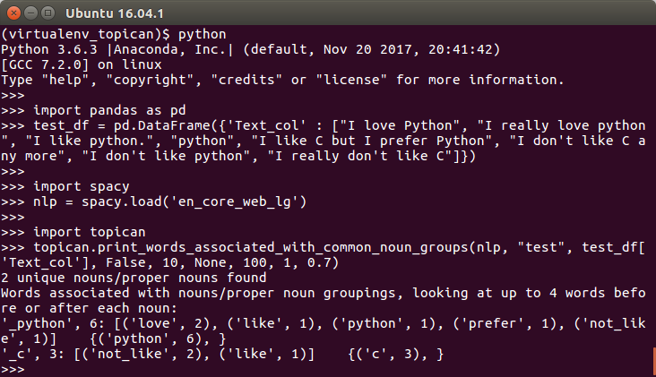

# Topican - topic analyzer

from  the command line:
```python3
topican_by_nouns_on_csv  
```
Identify topics by assuming topics can be identified from Nouns and a "context" word:  
- [spaCy](https://spacy.io/) is used to identify Nouns (including Proper nouns) in the text  
- nltk WordNet and spaCy are used to group similar nouns together (WordNet "hyponyms" are checked first; spaCy similarity is used if a hyponym is not found)  
- the top context words are then found for each noun  
- Output is a list of noun groups and associated context words, in order of frequency  
- The output also indicates the nouns that were grouped together

For example, the text "I like python", "I love Python", and "I like C" would be analysed as having 2 topic groups "_python" and "_C":
```python3
    '_python', 2: [('like', 1), ('love', 1),]    {('python', 2), }
    '_C', 1: [('like', 1), ]    {('C', 1), }
```

## Meta
Richard Smith – randkego@gmail.com

Distributed under the MIT license. See ``LICENSE`` for more information.

[https://github.com/randkego/topican](https://github.com/randkego/topican)

## Installation

Pre-requisites (Linux and Windows):

```sh
pip3 install topican

# Install spaCy's large English language model
# ** Warning: this requires approx 1GB of disk space
python3 -m spacy download en_core_web_lg

```

Notes: Additional pre-requisites for Windows:  
- ```install spacy``` will fail if Microsoft Visual C++ is not already installed 
([https://visualstudio.microsoft.com/visual-cpp-build-tools/](https://visualstudio.microsoft.com/visual-cpp-build-tools/) may help in this case)  
- ```spaCy download en_core_web_lg``` may be unable to create a symbolic link. This can be manually created if required


## Usage
from the command line:
```python3
usage: topican_by_nouns_on_csv [-h]
                               filepath text_col exclude_words
                               top_n_noun_groups top_n_words max_hyponyms
                               max_hyponym_depth sim_threshold

positional arguments:
  filepath           path of CSV file
  text_col           name of text column in CSV file
  exclude_words      words to exclude: list of words | True to just ignore
                     NLTK stop-words | False | None
  top_n_noun_groups  number of noun groups to find (0 to find all
                     noun/'synonym' groups)
  top_n_words        number of associated words to print for each noun group
                     (0 to print all words)
  max_hyponyms       maximum number of hyponyms a word may have before it is
                     ignored - use this to exclude very general words that may
                     not convey useful information (0 to have no limit on the
                     number of hyponyms a word may have)
  max_hyponym_depth  level of hyponym to extract (0 to extract all hyponyms)
  sim_threshold      spaCy similarity level that words must reach to qualify
                     as being similar

optional arguments:
  -h, --help         show this help message and exit
```

as a function:
```python3
topican.print_words_associated_with_common_noun_groups(
    nlp, name, free_text_Series, exclude_words, top_n_noun_groups, top_n_words, max_hyponyms, max_hyponym_depth, sim_threshold)
```
- nlp: spaCy nlp object - this must be initialised with a language model that includes the word vectors
- name: descriptive name for free_text_Series
- free_text_Series: pandas Series of text in which to find the noun groups and associated words
- exclude_words: to ignore certain words, e.g. not so useful 'stop words' or artificial words.  
  This should take one of the following values:  
  <nbsp>- True: to ignore NTLK stop-words and their capitalizations  
  <nbsp>- A list of words to exclude  
  <nbsp>- False or None otherwise
- top_n_noun_groups: number of noun groups to find (specify 'None' to find all noun/'synonym' groups)
- top_n_words: number of words that are associated with each noun group (specify 'None' for all words)
- max_hyponyms: the maximum number of hyponyms a word may have before it is ignored (this is used to
  exclude very general words that may not convey useful information: specify 'None' for no restriction)
- max_hyponym_depth: the level of hyponym to extract (specify 'None' to find all levels)
- sim_threshold: the spaCy similarity level that words must reach to qualify as being a similar word


## Usage examples
from the command line:
```python3
topican_by_nouns_on_csv test.csv text_col None 10 0 100 1 0.7
```

function:
```python3
# Some text to test
import pandas as pd
test_df = pd.DataFrame({'Text_col' : ["I love Python", "I really love python", "I like python.", "python", "I like C but I prefer Python", "I don't like C any more", "I don't like python", "I really don't like C"]})

# Download NLTK stop-words if you want them in exclude_words
import nltk
nltk.download('stopwords')

# Load spaCy's large English language model (the large model is required to be able to use similarity)
# ** Warning: this requires approx 1.8GB of RAM
import spacy
nlp = spacy.load('en_core_web_lg')

import topican
topican.print_words_associated_with_common_noun_groups(nlp, "test", test_df['Text_col'], False, 10, None, 100, 1, 0.7)
```


## Release History

* 0.0.17
    * First release to GitHub
* 0.0.18
    * Updates to README.md to note Windows install pre-requisites and the need to download wordnet
* 0.0.19
    * Add script topican_by_nouns_on_csv to apply print_words_associated_with_common_noun_groups to a text column of a CSV file
    * function get_top_word_groups_by_synset_then_similarity: allow max_hyponyms and n_word_groups to be None to indicate no restriction on them
    * function print_words_associated_with_common_noun_groups: do not list words that will be excluded
* 0.0.20
    * Update setup.py to add a topican_by_nouns_on_csv as an entry_point to console_scripts to be able to call that scipt directly
* 0.0.21
    * Update setup.py to add the packages required for installation
* 0.0.22
    * topican_by_nouns_on_csv.py: fix main signature and add param to parser.parse_args so that topican_by_nouns_on_csv can be called from the command line; remove nargs='+' type for exclude_words
* 0.0.23
    * topican_by_nouns_on_csv.py: if exclude_words is True, nltk.download('stopwords')
* 0.0.24
    * README.md: in the usage example for the function, download 'stopwords' not 'wordnet'
    
## Contributing

1. Fork it (<https://github.com/randkego/topican/fork>)
2. Create your feature branch (`git checkout -b feature/fooBar`)
3. Commit your changes (`git commit -am 'Add some fooBar'`)
4. Push to the branch (`git push origin feature/fooBar`)
5. Create a new Pull Request

<!-- Markdown link & img dfn's -->
[wiki]: https://github.com/randkego/topican/wiki
